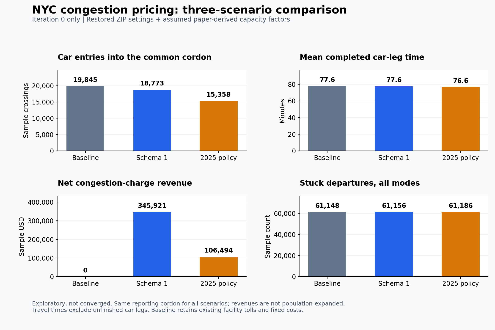

# MATSim NYC: modernized exploratory congestion-pricing scenarios

A Java 25 / MATSim 2026.0 modernization of C2SMART's released NYC model, with a baseline, reconstructed Schema 1 cordon, and a modeled launch-2025 congestion-pricing policy. This is an independent research workspace, not an official MTA model or a validated forecast of 2025 outcomes.

## This fork: simulation acceleration (branch `perf/simulation-redundancy`)

This fork builds on [harrrisw/matsim-nyc-modernized](https://github.com/harrrisw/matsim-nyc-modernized).
Its goal is to shorten multi-iteration MATSim runs **without changing results**, and to turn the redundancy
inside the simulation into measurable research questions.

### What was optimized, and the effect

Setting: 2025 pricing scenario, full population (389,301 agents), seed 4711, 16 threads, 12 iterations, one paired run.

| | Upstream | This fork | Change |
|---|---:|---:|---:|
| 12-iteration wall time | 2,139.9 s | 1,574.0 s | **−26.4%** |
| Traffic simulation (mobsim), total | 1,611 s | 1,063 s | **−34%** |
| Output size | 15.1 GB | 2.9 GB | −81% |
| Per-iteration metric differences | — | **0** | counts and cents exactly equal; other values within rtol 1e-9 |

1. **Online metrics instead of per-iteration event output (E1; almost all of the gain).**
   Upstream writes about 80 million events (≈1.1 GB of XML) every iteration only so that indicators can be
   computed offline afterwards. The writing happens on the single events thread and slows the traffic simulation.
   `IterationMetrics` (`-Dnyc.onlineMetrics=true`) computes the same indicators during the run — cordon entries,
   car-leg durations, waiting and not-boarded passengers, charge revenue, unfinished trips — and writes
   `iteration-metrics-N.json` per iteration. Use it together with `controller.writeEventsInterval=0`.
2. **Index-based pricing lookups (E2).** `Pricing2025` and `LegacyCosts` converted every link ID to a string
   for set lookups in routing and event handling; they now use per-link flag arrays indexed by `Id.index()`.
   Results are bit-identical, but the timing change is within noise (−2.9% in screening).
3. **Measuring in-simulation redundancy (research).** Comparing consecutive iterations of a 12-iteration run:
   - only 9–13% of agents are replayed event-for-event;
   - about 40% keep the same modes and routes and their travel time changes by at most one minute;
   - among agents who switch plans, the share returning to a plan they already tried rises from 59%
     (iteration 8) to about 99% once innovation is switched off;
   - changes in traffic state are global rather than local.

   The remaining cost therefore comes from the traffic interaction itself, which calls for approximate or learned methods.
   Follow-up work on pseudo-simulation and learned surrogates is in progress under `experiments/surrogate/`;
   it is not yet a validated result.

### Running on a server

[docs/server-runbook.md](docs/server-runbook.md) takes a fresh Linux server from installation to a
reproduction check and the 100-iteration multi-seed reference run
(`experiments/reference/run_reference.py`), using only files in this repository.

### How "unchanged results" is verified

- `scripts/VerifyPricingReplay.java`: replaying a full real iteration through the new code reproduces all
  569,387 charge events in the same order; route-search tolls are bit-identical on 112.6 million link × time cells.
- `scripts/ReplayIterationMetrics.java`: the online metrics equal an offline scan of the event file.
- `experiments/performance/redundancy_campaign.py`: paired timing on an independent ledger with a
  per-iteration comparison of all 12 iterations.
- `experiments/redundancy/`: redundancy measurement scripts and the method write-up.

### Caveats

- With E1, no event files are written at all by default. If tools that need events (e.g. `scripts/compare.py`)
  are used, set `writeEventsInterval` to the last iteration number so that only iteration 0 and the last
  iteration are written.
- Single scenario and seed. Only the observed indicators are shown to be identical; event order, individual
  trajectories, convergence and real-world validity are not claimed.
- Upstream attribution and the GPL-3.0 license are unchanged.

## Included

- Java source, Maven build, and synthetic regression checks.
- Compressed network, migrated synthetic population (389,301 agents), transit schedule/vehicles, mode vehicle types, and traffic counts: approximately 45 MB total repository size.
- Common model settings and the three policy scenarios, cordon geometry/link lists, and explicit capacity assumptions.
- Portable experiment launcher and event-analysis utility.

Raw simulation outputs, JDK/Maven installations, dependency caches, and compiled jars are excluded. The separate 10.9 GB population CSV is not required for these supplied simulation inputs.

## Setup

Install **JDK 25**, **Maven 3.9+**, and **Python 3.11+**. Put `java`, `javac`, and `mvn` on PATH, or set JAVA_HOME for the scripts. Downloads: [Java](https://adoptium.net/), [Maven](https://maven.apache.org/download.cgi), [Python](https://www.python.org/downloads/).

From the repository root:

```sh
mvn -DskipTests package
python scripts/verify.py
```

Maven downloads the pinned dependencies from Maven Central and the MATSim repository. A normal build uses no machine-specific dependency cache. Python's standard library suffices for the launcher; optional analysis packages install with `python -m pip install -r requirements.txt`.

## Run all three scenarios

```sh
python scripts/run_experiment.py --exploratory --iterations 1
```

This runs baseline, Schema 1, then 2025 policy sequentially, each for **iteration 0 only**, using a 16 GB Java heap. Allow additional system memory. Use `--heap 24g` if appropriate for your machine. Results, logs and completion-status files go into a unique `outputs/experiment-*` directory. Existing outputs are never overwritten. `--prepare-only` verifies input hashes and generates configs without launching a simulation. Increase `--iterations` to allow behavioral adaptation; one iteration is not convergence.

The baseline removes only the new congestion charge: historical facility tolls, parking and other fixed costs remain. All arms share the same input population, seed, road modes, scoring and capacity assumptions.

After a completed exploratory run, create the iteration-zero comparison chart and report:

```sh
python -m pip install -r requirements.txt
python scripts/compare.py outputs/experiment-YOUR-TIMESTAMP
```

The comparison tool currently measures iteration 0, even for longer experiments. It streams the three event files and reports common-boundary private-car crossings, completed car-leg times, congestion revenue and unfinished departures. It is intended for the exploratory profile; its labels explicitly describe the assumed capacity factors.

## Calibration boundary

The released ZIP hard-codes speed multipliers but loads capacity multipliers from external `theta_up_down{k}.csv` files not included in the release. No verified final capacity vector is available here. The strict no-argument Java runner therefore requires a separately supplied `scenarios/nyc-zip-aligned/capacity-factors.csv`.

`--exploratory` explicitly uses `assumptions/paper-capacity-factors.csv`: published-table values previously reconstructed for this workspace. Applying those values at the archive's 00/07/10/13/16/19/22 network-change times is a hybrid assumption, **not exact reproduction of the ZIP's calibration**. Alternatively provide a verified vector with `--capacity-factors PATH`; CSV header is `period,expressway,arterial` followed by six positive finite factor rows indexed 0..5.

The modernized profile restores QSim road simulation for car, taxi and FHV, archived speed multipliers and scoring coefficients. It does not add the previously inferred extra PT fare. Modern transit-walk compatibility and safer driver attribution remain deliberate changes. Engine versions differ; exact old-engine equivalence is not claimed.

## Pricing scope and limits

Schema 1 charges private cars on reconstructed entry and exit links ($9.18 in 06–10/14–20 peaks, $3.06 otherwise). The 2025 implementation models weekday E-ZPass charges ($9 first daily entry in 05–21, $2.25 overnight), selected tunnel credits, and participating taxi/FHV per-trip charges ($0.75/$1.50). Historical demand and transit inputs are not updated to 2025.

No explicit empty taxi fleet circulation is modeled. Truck, motorcycle, mail-payment, weekend, low-income and special-exemption categories are not comprehensively represented. Route-search toll costs approximate daily caps/credits even though realized billing is stateful. Zone mapping on the historical network is approximate. See source and [provenance](PROVENANCE.md) before interpreting outcomes.

## Example, not validation



The chart is from three completed September 26, 2026 exploratory runs. It is retained as a small illustrative artifact; raw outputs are excluded. [Underlying metrics](docs/iteration0-comparison.json). Differences in cordon traffic are initial model responses, not observed 2025 effects. Mode-share adaptation needs further iterations; unfinished trips and geographic aggregation limit interpretation.

## Attribution

Based on [C2SMART Center, Code for MATSim-NYC project (2022), DOI 10.5281/zenodo.7430184](https://doi.org/10.5281/zenodo.7430184) and [the MATSim-NYC paper](https://arxiv.org/abs/2008.04762). Preserve upstream attribution and the supplied [GPL-3.0 license](LICENSE). Source data and boundary provenance are described separately in [PROVENANCE.md](PROVENANCE.md).

## Baseline diagnostics (full population, old fixed-entry capacities)

For the local side-by-side checkout with `../C2SMART-Year3-Project`, the diagnostic
runner extracts the **active** `ExpressFactor` and `ArterialFactor` arrays from
`RunTimeDependentNetworkExample.java`. These are old fixed-entry parameters, not
verified final calibration results. The old repository is read-only.

Place the local toolchain
paths in `.tools/environment.json` (`java_home`, `maven`), then use `--build-only`. The executor checks
`.tools/build-status.json` and `.tools/verify-status.json` for `exit_code: 0` and
copies their logs. The current task's verified installations and build evidence
are retained there. Use the virtual environment containing `zstandard`:

```sh
.venv/bin/python scripts/run_baseline_diagnostic.py --build-only
.venv/bin/python scripts/test_baseline_diagnostic.py
.venv/bin/python scripts/run_baseline_diagnostic.py --prepare-only
.venv/bin/python scripts/run_baseline_diagnostic.py --run-dir outputs/baseline-diagnostic-TIMESTAMP
.venv/bin/python scripts/run_baseline_diagnostic.py --analyze-only --run-dir outputs/baseline-diagnostic-TIMESTAMP
```

Preparation prints the exact run directory. Execution runs **only baseline**:
first iteration 0, then an independent run of iterations 0–4. Both retain the
full 389,301-person input, seed 4711, 16 threads, original behavioral settings and
capacity scaling. Input hashes are cached against file metadata. Each output
attempt is new and cannot overwrite another. Scripts and a runnable JAR are
snapshotted alongside commands, input identifiers and effective MATSim configs.

All simulation attempts share one persisted **eight-hour budget**. A directory
lock prevents concurrent executors. A failed or uncleanly interrupted attempt
requires inspection before resuming, and the existing budget must not be reset.
The budget includes process startup, shutdown and retries; preparation, building
and offline analysis are timed separately. The initial Java heap limit is 16 GiB;
one 24 GiB retry is allowed only for a clear heap OOM without resource pressure.
Heap size is not total process memory. RSS sampling runs every ten seconds;
macOS memory pressure, swap and disk checks run every minute. The executor stops
on less than 30 GiB free disk, critical memory pressure lasting 60 seconds, swap
growth over 2 GiB within five minutes, or budget exhaustion.

The short run retains innovation fraction 0.8 and therefore is **not the prefix
of a 0–100 run**. Actual strategy evidence, logs, resource samples and metrics
are saved per attempt. Stopwatch operations include callbacks and potentially
I/O; missing measurements remain blank. Offline historical-charge checks inspect
`personScore` events separately from added congestion-charge `personMoney`
events. Negative utility changes are not fiscal revenue or dollar welfare.
Successful diagnostics do not establish convergence, old-engine equivalence,
or real-world predictive validity.

## Fixed-plan bus capacity diagnostic

`scripts/run_bus_capacity_diagnostic.py` prepares two independent baseline iteration-0
runs using the selected plans serialized before iteration 4 of the recorded baseline
campaign. It preserves all 389,301 persons, disables replanning, and changes only bus
seats and standing capacity by a factor of two. Shared transit vehicles/types, if any,
are normalized in both arms before treatment is applied. The opt-in
`nyc.fixedPlanGuard` rejects initialization changes before traffic execution.

Use the project JDK 25 and Maven to build, then:

```sh
.venv/bin/python scripts/run_bus_capacity_diagnostic.py --prepare-only
.venv/bin/python scripts/run_bus_capacity_diagnostic.py --run-dir outputs/bus-capacity-diagnostic-TIMESTAMP
.venv/bin/python scripts/run_bus_capacity_diagnostic.py --run-dir outputs/bus-capacity-diagnostic-TIMESTAMP --analyze-only
.venv/bin/python scripts/test_bus_capacity_diagnostic.py
```

The two arms and retries share a persistent two-hour simulation budget. Analysis
includes censored waiting, re-identifies the control's full-vehicle cohort, and
separates target-leg completion from reaching the final scheduled activity.
`comparison.csv` uses treatment minus control. These are mechanism diagnostics,
not population-expanded forecasts, welfare estimates, or calibrated capacity targets.
